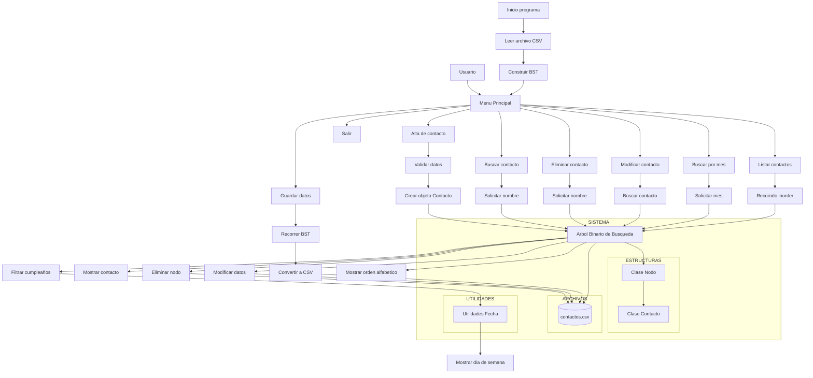

# TLP-Crystal
# Requerimientos del proyecto

En equipos, diseñar e implementar una aplicación usando el lenguaje de programación asignado. La aplicación consistirá en un programa para guardar y consultar la información de un grupo de contactos. La información que se requiere almacenar para cada contacto es: nombre, fecha de cumpleaños (dd/mm), teléfono y correo electrónico. La información de los contactos se deberá almacenar en un archivo en almacenamiento secundario antes de terminar la ejecución de la aplicación para mantener su persistencia, y al iniciar la ejecución de la aplicación se deberá leer del archivo la información de los contactos.

Las opciones de la aplicación serán al menos:

1. agregar un contacto;
2. borrar un contacto;
3. consultar los datos de un contacto especificado por nombre;
4. listar los contactos y su fecha de cumpleaños ordenados a partir del día actual;
5. listar todos los contactos ordenados alfabéticamente por nombre junto con su teléfono y correo-e.

